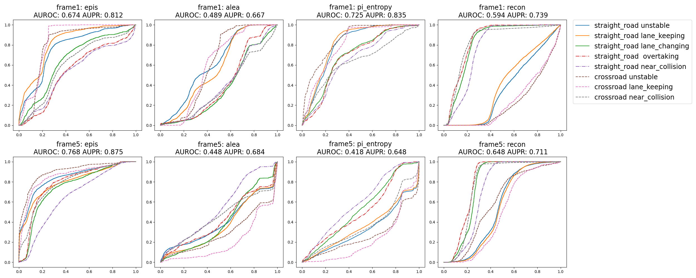
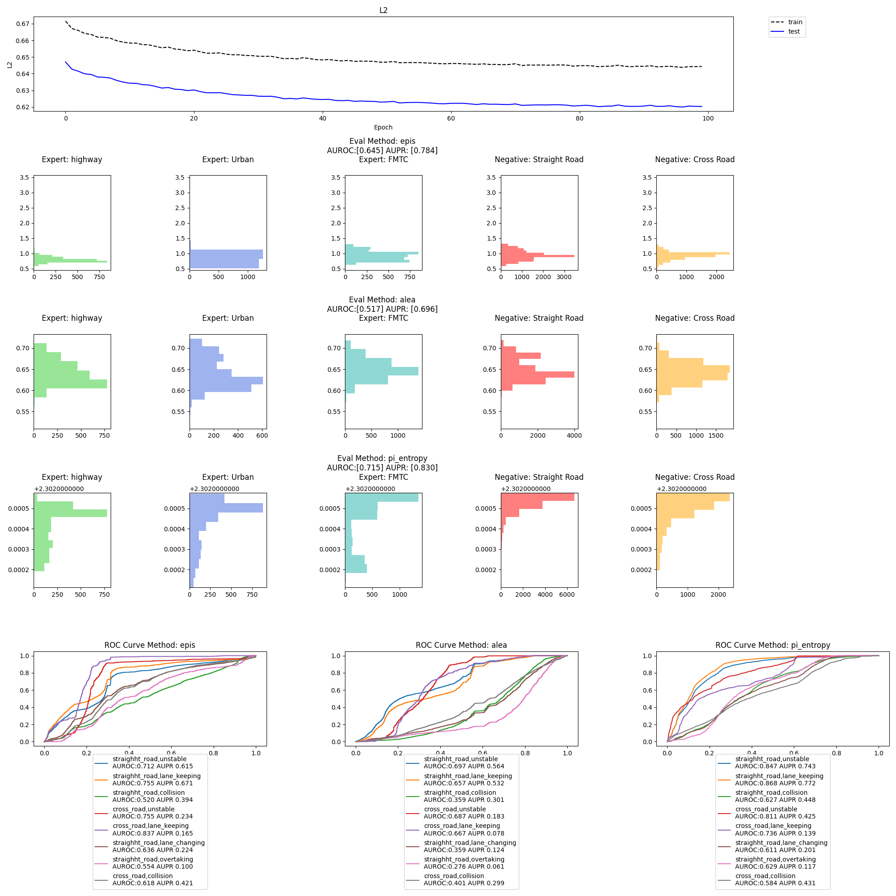

# MDN-DrivingDataset

This repository is abnormal experiments on paper:

**Towards Defensive Autonomous Driving: Collecting and Probing Driving Demonstration of Mixed Qualities.**

## Download Dataset
Clone R3-Driving Dataset from [Dataset](https://github.com/rllab-snu/R3-Driving-Dataset)
'''
git clone https://github.com/rllab-snu/R3-Driving-Dataset.git
'''

## Script files
'''
cd script
'''

Run Mixture Of Density Network 
'''
./mdn.sh
'''

Run Variational Auto Endcoder Network
'''
./vae.sh
'''

## Python files
- Run main.py
'''
python main.py [-h] [--root ROOT] [--id ID] [--mode MODE] [--gpu GPU] [--frame FRAME] [--exp_case EXP_CASE [EXP_CASE ...]] [--epoch EPOCH] [--lr LR] [--batch_size BATCH_SIZE]
               [--wd WD] [--dropout DROPOUT] [--lr_rate LR_RATE] [--lr_step LR_STEP] [--k K] [--norm NORM] [--sig_max SIG_MAX] [--h_dim H_DIM [H_DIM ...]] [--z_dim Z_DIM]
'''

optional arguments:
  -h, --help            show this help message and exit
  --root ROOT           root directory of the dataset
  --id ID               id
  --mode MODE           mdn vae
  --gpu GPU             gpu id

  --frame FRAME         how many frames stacked for input
  --exp_case EXP_CASE [EXP_CASE ...]
                        if you want to train specific expert case
  --norm NORM           normalize dataset elementwise
  
  --epoch EPOCH         epoch
  --lr LR               learning rate
  --batch_size BATCH_SIZE
                        batch size
  --wd WD               weight decay
  --dropout DROPOUT     dropout rate
  --lr_rate LR_RATE     learning rate schedular rate
  --lr_step LR_STEP     learning rate schedular step

  --k K                 number of mixtures for MDN
  
  --sig_max SIG_MAX     sig max for MDN
  --h_dim H_DIM [H_DIM ...]
                        h dim for VAE
  --z_dim Z_DIM         z dim for VAE
- Plot single result
'''
python plot.py [-h] [--id ID] [--mode MODE]
'''

optional arguments:
  -h, --help   show this help message and exit
  --id ID      id
  --mode MODE  mdn vae

example)

where first row presents loss over epoch,
second row denotes histogram of each expert and abnormal data
third row is ROC curve among each uncertainty measures.